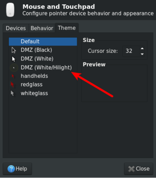

# DMZ-White-Highlighted

The highlighted DMZ-White cursor theme is Ubuntu cursor theme for using in presentation or screencasting.
I found the resource talking about how to highlight the cursor while casting,
    [here](https://unix.stackexchange.com/questions/241082/highlight-mouse-for-screencasts-without-disturbing-workflow).
Then, after following, the source that gives me the 
    [pre-edited theme](
    https://github.com/mzijlstra/hlCursors/releases/download/0.02/DMZ-White-Highlighted.tar.gz) 
    also provides a program to make your own highlighted cursor:
    https://github.com/mzijlstra/hlCursors/.


## Quick Installation

Clone the new theme into __.icons/__ in your home directory:

```bash
> cd ~/.icons
> git clone https://github.com/iPAS/DMZ-White-Highlighted.git
```

Open the "Mouse and Touchpad" window to configure:


